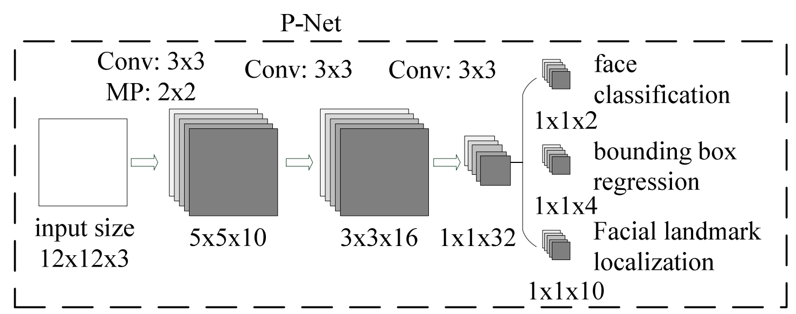
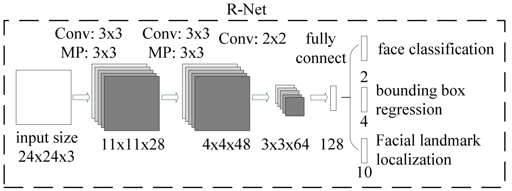
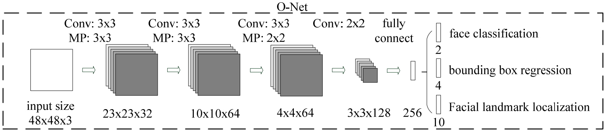
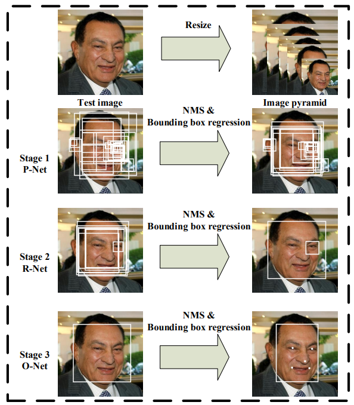
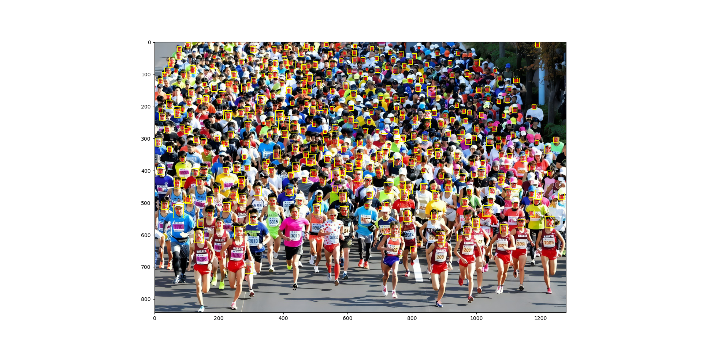
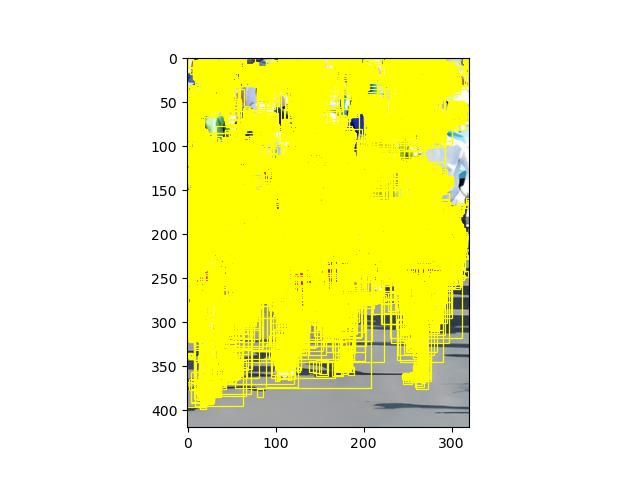
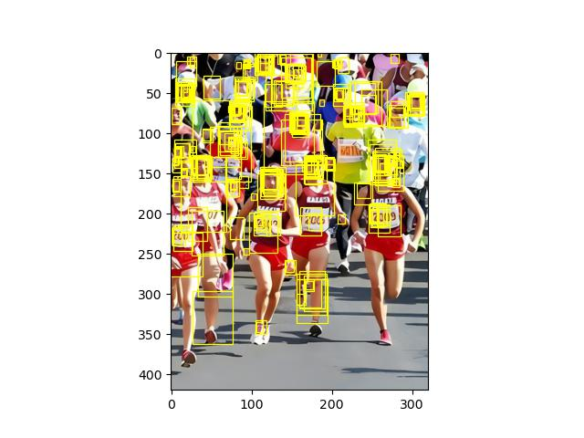

\
**人工智能原理实验第二次作业**\
by **！！！**

# 1.MTCNN说明

MTCNN是2016年中国科学院深圳研究院提出的用于人脸检测任务的多任务神经网络模型，将人脸区域检测与人脸关键点检测放在了一起，总体可分为P-Net、R-Net、和O-Net三层网络结构。

[论文](https://ieeexplore.ieee.org/abstract/document/7553523) ：Zhang K, Zhang Z, Li Z, et al. Joint face detection and alignment using multitask cascaded convolutional networks[J]. IEEE signal processing letters, 2016, 23(10): 1499-1503.

# 2.模型架构
首先将原图进行不同大小的随机裁剪，把裁剪结果按照其与人脸之间的IoU分为正例、负例以及中间类型，进行数据集的构建。这使得网络可以检测到不同大小的人脸而进行的多尺度检测。然后将这些尺寸相同而尺度不同的图片送入3个级联网络进行训练。

我们首先来看一下网络的第一部分：P-Net。P-Net全称为Proposal Network，其基本的构造是一个全卷积网络。对上一步得到的图像，通过一个FCN进行初步特征提取，最后得到的特征向量分为两部分（下图为三部分，以代码为准），分别是对负例以及非负例的预测，以及边界框的坐标回归结果。最后进行Bounding-Box Regression调整窗口与NMS进行大部分窗口的过滤。

然后是网络的第二部分：R-Net。R-Net全称为Refine Network，其基本的构造也是一个卷积神经网络。在图片经过P-Net后，会留下许多预测窗口，我们将所有的预测窗口送入R-Net，这个网络会滤除大量效果比较差的候选框，最后对选定的候选框进行Bounding-Box Regression和NMS进一步优化预测结果。

最后是网络的第三部分：O-Net。O-Net全称为全称为Output Network，基本结构是一个更为复杂的卷积神经网络，相对于R-Net来说多了一个卷积层。O-Net的效果与R-Net的区别在于这一层结构会对人的面部特征点进行回归（如人眼，鼻子等），最终输出五个人脸面部特征点以及最终的人脸边界框。

## 2.1训练阶段
对网络进行训练和测试时，图片变化的整体流程如下图所示：

P-Net的训练数据是从WIDER FACE获取，由于训练时人脸边界框的真值已知，所以会直接在GT附近对图像进行裁剪得到训练图片。R-Net的训练数据是P-Net生成， O-Net的训练数据是R-Net生成，landmark数据由CelebA得到。负例、正例以及部分例的数量之比大概都为3:1:1。

三个网络的训练是先后进行的，先对P-Net进行训练，训练好后再对R-Net进行训练，R-Net训练好后再对O-Net进行训练，形成了一种级联的结构。

MTCNN的损失函数主要包括3个部分，分别是人脸-非人脸二分类器的损失、边界框回归的损失、以及人脸特征点的损失。由于本项目不会进行人脸特征点的检测，所以下面只介绍前两个部分的损失函数。人脸分类所采用的是经典的交叉熵损失函数如下，边界框回归部分，则使用均方误差（欧氏距离）来作为损失函数。

## 2.2测试阶段
在测试/预测时，我们该如何生成锚框以作为网络的初始输入呢？作者在这里没有直接随机生成锚框，而是直接向P-Net中输入整张图片，那么得到的特征图的空间大小将近似等于原来的一半，可以认为，这是模型对原图中彼此相距为1的像素格点附近的12×12锚框的预测结果。为了让锚框在大小固定时能对应到原图中大小不同的区域，作者会对图像进行级联的缩小，也就是构建所谓的图片金字塔。

在P-Net生成完候选框之后，R-Net和O-Net所进行的处理就与训练过程相差不大了。

# 3.数据集

论文里使用的是WIDER FACE和CelebA两个数据集，其中WIDER FACE用作回归人脸分类和边界框，CelebA用来回归关键点（landmark）。为节省训练时间起见，这里只使用了WIDER数据集中的两类。

- 数据集大小：共312张彩色图像
    - 训练集：311张图像
    - 测试集：1张图像
- 数据格式：jpg格式的RGB图像。

# 4.环境要求

- 硬件（支持CUDA的GPU）
    - 使用支持CUDA的GPU处理器来搭建硬件环境。
- 深度学习框架
    - [PyTorch 1.12](https://pytorch.org/)
- 其他包
    - torchvision 0.13
    - matplotlib 3.5
    - opencv 4.6
    - numpy 1.23

# 5.程序说明

## 5.1训练过程

首先需要运行`./gen_Pnet_train_data.py`，`assemble_pnet_imglist.py`，`train_p_net.py`来生成P-Net训练集和训练P-Net，接着通过运行`./gen_rnet_train_data.py`，`assemble_Rnet_imglist.py`，`train_r_net.py`来生成R-Net训练集和训练R-Net，最后运行`./gen_Onet_train_data.py`，`assemble_onet_imglist.py`，`train_o_net.py`来生成O-Net训练集和训练O-Net。
训练过程中会自动在`model_store`文件夹中保存模型参数。

## 5.2测试过程

通过运行`mtcnn_test.py`文件进行测试
GPU评估结果保存在脚本路径`./test_result`下。

## 5.3检测效果展示

可以看出检测效果较为理想，这是因为我们进行了相关的改进，这在下一节中将会介绍。

## 5.4 中间结果的可视化
P-Net的输出：

R-Net的输出：

# 6.效果提升
## 6.1提升方法
首先，由于原图较为模糊，所以我们用超分辨率的方法将原图的大小提升为1280*842。
然后，由于图像中大部分脸都很小，所以需要把`min_face_size`这个参数调小，这里我们将其设为6。
此外，需要降低置信度阈值，以将尽可能多地把人脸检测框包括进来，这里我们将其设为`threshold=[0.1, 0.1, 0.1]`。
最后，在训练P-Net时可以加入随机的灰度变换，以使得模型对原图右上角暗处的人脸也有较好的检测效果。
